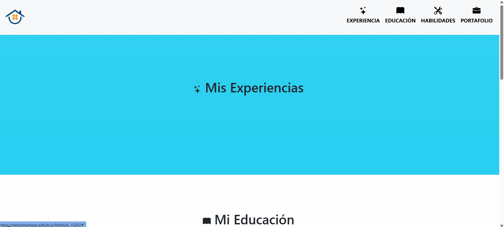
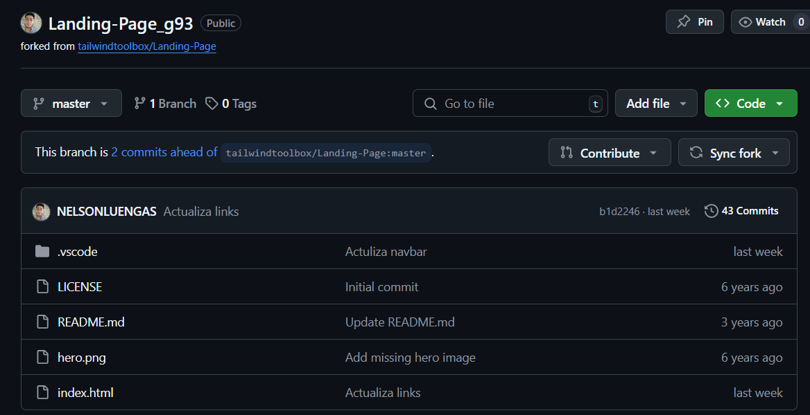
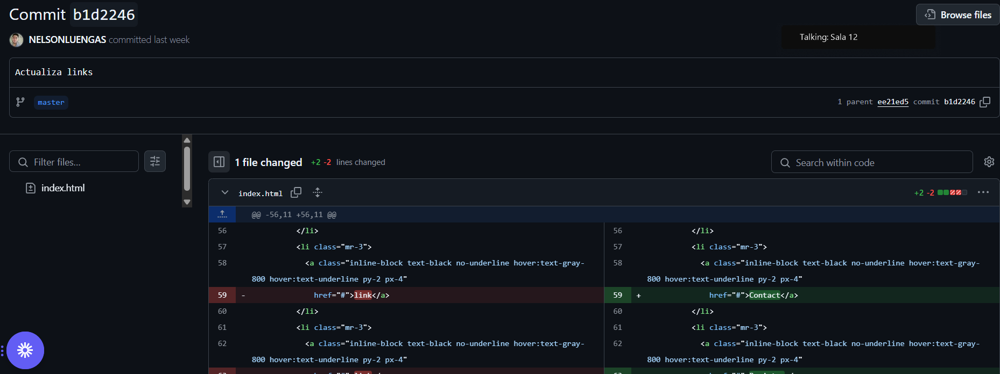

# Modulo_1 G93

  **Proyecto de casas**
  
  - Paso 1: ``` git init ```
  - Paso 2: ``` git branch -M main ```
  - Paso 3: `git add -A`
  - Paso 4: ```git commit -m "Cualquier mensaje"```
  - Paso 5: ```git push --set-upstream origin main``` (Solo la primera vez), lurgo solo ```git push```
  

  **Pasos para clonar**
  - Paso 1: `git clone <url> <nombre de directorio local> (https://github.com/tailwindtoolbox/Landing-Page.git) `
  - Paso 2: `cd <nombre del directorio> (Landing-Page)`
  - Paso 3: `code .`

  Prueba Daniela Elizondo Prueba1
  

# Link Ejemplo

  * [Repositorio clonado](https://github.com/NELSONLUENGAS/Landing-Page_g93)


# Ejemplo de entrega 

- Mi cv: 
  
  * Link: [Pagina web](https://nelsonluengas.github.io/Modulo_1G93/)
  * Image:
  

- Foks:
  
  * Link: [Fork a Repositorio de Pepito](https://github.com/NELSONLUENGAS/Landing-Page_g93)
  * Image:
  

- Commits:
   
  * Link: [Commit Actuliza links](https://github.com/NELSONLUENGAS/Landing-Page_g93/commit/b1d2246fbc10dedea52497759820c00baf883168)
  * Image:
  